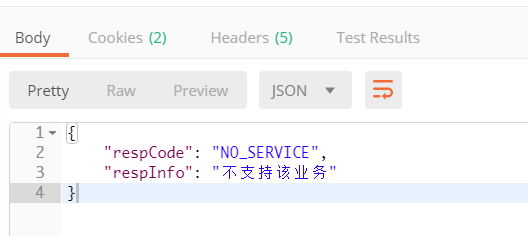
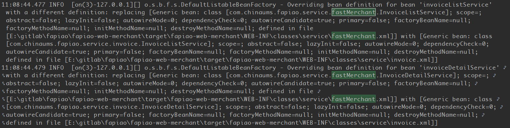

问题表象：



经过查看日志发现同一个xml文件中的四个bean配置，有两个成功加载，还有两个没能正确加载成功。继续分析日志发现：



```
11:08:44.477 INFO  [on(3)-127.0.0.1][] o.s.b.f.s.DefaultListableBeanFactory - Overriding bean definition for bean 'invoiceListService' with a different definition: replacing [Generic bean: class [com.chinaums.fapiao.service.fastMerchant.InvoiceListService]; scope=; abstract=false; lazyInit=false; autowireMode=0; dependencyCheck=0; autowireCandidate=true; primary=false; factoryBeanName=null; factoryMethodName=null; initMethodName=null; destroyMethodName=null; defined in file [E:\gitlab\fapiao\fapiao-web-merchant\target\fapiao-web-merchant\WEB-INF\classes\service\fastMerchant.xml]] with [Generic bean: class [com.chinaums.fapiao.service.invoice.InvoiceListService]; scope=; abstract=false; lazyInit=false; autowireMode=0; dependencyCheck=0; autowireCandidate=true; primary=false; factoryBeanName=null; factoryMethodName=null; initMethodName=null; destroyMethodName=null; defined in file [E:\gitlab\fapiao\fapiao-web-merchant\target\fapiao-web-merchant\WEB-INF\classes\service\invoice.xml]]
```

Overriding bean definition ，spring的bean即对象的id重名了，导致没能正确加载bean。