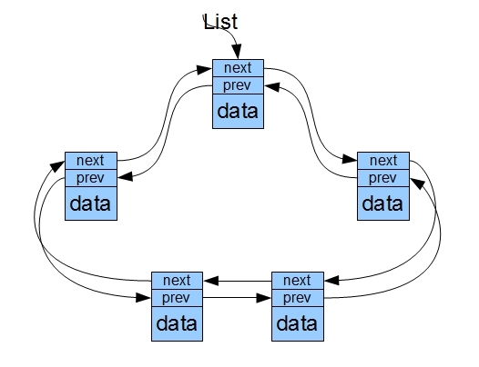

#  数组，链表，队列和栈以及它们之间的关系

数据结构中有两个概念，一个叫数据的逻辑结构，另外一个叫数据的存储结构。数据的逻辑结构就是描述数据对象间逻辑关系，比如：队列就是一种先进先出的逻辑结构，栈是一种先进后出的逻辑结构，家谱是一种树形的逻辑结构！数据的存储结构，是计算机的一个概念，简单讲，就是描述数据在计算机中存储方式。常用的数据存储方式就两种：顺序存储，非顺序存储！顺序存储就是把数据存储在一块连续的存储介质（比如硬盘或内存）上。举个例子：从内存中拿出第100个字节到1000个字节间的连续位置，存储数据；**数组** 就是典型的顺序存储。非顺序存储就是各个数据不一定存在一个连续的位置上，只要每个数据知道它前面的数据和后面的数据，就能把所有数据连续起来啦；**链表** 就是典型的非顺序存储啦！

**数组，链表，队列，栈** 他们是最基本的数据结构。

- **数组**：数组是最最基本的数据结构，很多语言都内置支持数组。数组是使用一块连续的内存空间保存数据，保存的数据的个数在分配内存的时候就是确定的：

  访问数组中第 n 个数据的时间花费是 O(1)， 但是要在数组中查找一个指定的数据则是 O(N)。当向数组中插入或者删除数据的时候，最好的情况是在数组的末尾进行操作，时间复杂度是O(1) ，但是最坏情况是插入或者删除第一个数据，时间复杂度是 O(N) 。在数组的任意位置插入或者删除数据的时候，后面的数据全部需要移动，移动的数据还是和数据个数有关，所以总体的时间复杂度仍然是 O(N) 。

- 链表：链表是在非连续的内存单元中保存数据，并且通过**指针**将各个内存单元链接在一起，最后一个节点的指针指向 NULL 。

  链表不需要提前分配固定大小存储空间，当需要存储数据的时候分配一块内存并将这块内存插入链表中。

  在链表中查找第 n 个数据以及查找指定的数据的时间复杂度是 O(N) ，但是插入和删除数据的时间复杂度是 O(1) ，因为只需要调整指针就可以：

  向上面这样的链表结构在插入和删除的时候编程会比较困难，因为需要记住当前节点的前一个节点，这样才能完成插入和删除。为了简便通常使用带有头节点的链表：

  上面的链表是单链表，此外还有双链表，就是节点中包含指向下一个节点的指针和指向上一个节点的指针：

  不带有头节点的双向链表在插入和删除数据的时候也不会出现单链表那样的问题。此外还有一种链表是循环链表，它是将双向链表的头尾相接：

  向循环双向链表和循环链表中插入或者从中删除数据只是多移动几个指针。

- **堆栈**：栈是一种先进后出的数据结构，可以用数组或者链表来实现它：

  对于堆栈中的数据的所有操作都是在栈的顶部完成的，只可以查看栈顶部的数据，只能够向栈的顶部压入数据，也只能从栈的顶部弹出数据。

- **队列**：队列是一种先进先出的数据结构，也可以用数组或者链表来实现它：

  队列只允许在*队尾添加数据*，在*队头删除数据*。但是可以查看队头和队尾的数据。还有一种是**双端队列**，在两端都可以插入和删除：

链表是一种存储方式，它可以在非连续的内存空间里面存储一个集合的元素。和它对应的是数组，数组要在连续的空间里存储集合的元素。链表实际上可以认为是一种数据的物理组织形式，是数据的存储结构，用指针或对象的引用组织起的一种数据的存储方式.   队列和堆栈是一个更高层次的概念，是数据的逻辑结构，其底层可以是用链表也可以是用数组来实现.     队列和堆栈的主要区别是进出的顺序不一样,   队列是先进先出,堆栈是后进先出.   